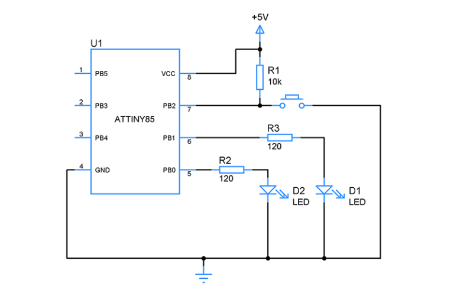

# Blik Project Readme

## Overview

This project, named "Blik," utilizes the ATtiny85 microcontroller and is developed using Microchip Studio. The primary functionality of this code involves controlling two LEDs (LEDPIN1 and LEDPIN2) based on a button press (BUTTONPIN). The ATtiny85 is programmed to toggle the LEDs in a specific pattern when the button is pressed.

## Components

### ATtiny85 Microcontroller

The ATtiny85 is a low-power 8-bit AVR microcontroller with 8KB of programmable flash memory. It is the central component of the project, responsible for handling input from the button and controlling the LEDs.

### Components Used

- **LEDPIN1 (PINB1):** First LED connected to PINB1.
- **LEDPIN2 (PINB0):** Second LED connected to PINB0.
- **BUTTONPIN (PINB2):** Button input connected to PINB2.

### Diagram 

## Libraries

The code utilizes several libraries to enable specific features and functionality. Below is a detailed description of the libraries used:

### avr/interrupt.h

This library is used to handle interrupts, specifically for Timer0 overflow and Pin Change Interrupts (PCINT).

### avr/sleep.h

The sleep library is employed to put the ATtiny85 into a low-power sleep mode (SLEEP_MODE_PWR_DOWN) when not actively processing tasks.

### avr/io.h

This library provides macros for register and bit manipulation, facilitating the configuration of I/O ports and other hardware peripherals.

### util/delay.h

The delay library is used to introduce delays in the code, ensuring that LED toggling occurs at specific intervals.

## Code Structure

### ISR(TIM0_OVF_vect)

This Interrupt Service Routine (ISR) handles Timer0 overflow interrupts. It is currently commented out in the code.

### ISR(PCINT0_vect)

This ISR manages Pin Change Interrupts (PCINT) on PINB5 (BUTTONPIN). It toggles the `button_pressed` boolean when the button is pressed.

### init()

The `init()` function initializes the hardware components and configurations necessary for the proper functioning of the project. This includes setting port B pins as outputs, configuring Timer0 for overflow interrupts, and enabling Pin Change Interrupts.

### main()

The `main()` function is the entry point of the program. It calls the `init()` function for initialization and enters an infinite loop. Within the loop, the program checks for a button press, and if detected, it toggles the LEDs in a specific pattern.

## How to Build and Flash the Code

To build and flash the code onto the ATtiny85 microcontroller using Microchip Studio, follow these steps:

1. Open Microchip Studio.
2. Create a new project for ATtiny85.
3. Copy and paste the provided code into the main source file.
4. Configure the project settings according to the ATtiny85 specifications.
5. Build the project to generate the hex file.
6. Connect a programmer (e.g., AVRISP) to the ATtiny85.
7. Flash the generated hex file onto the ATtiny85 using the programmer.

## Additional Notes

- Ensure the F_CPU (clock frequency) is correctly set to match the actual frequency of the microcontroller.
- Adjust the LED toggling pattern and delay values as needed.

Feel free to customize the code for your specific requirements and hardware setup.
